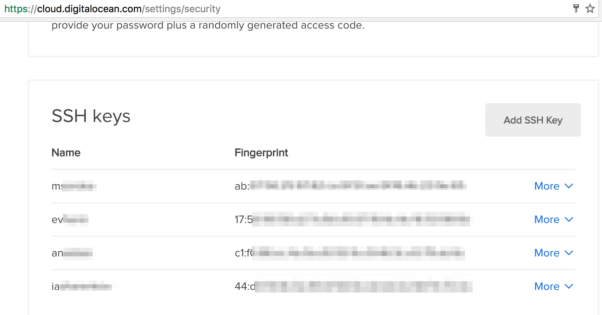

What if some cool engineer will join your devops-backend team?

You need to add his public RSA key to the server!

There's two options: if your key was on Digital Ocean before (means, that Droplet root user already has your key) or if you're totally newbie.


# I've added ssh key on DO, but now I need to add it on server

You may use this command:

```bash
`ansible-playbook -i inventories/staging init.yml --ask-vault-pass -t update_pubkey`
```
It will ask you vault password. Please, check your projects' wiki to get all passwords.


# I'm totally newbie

## Adding ssh key on Digital Ocean

Settings -> Security (https://cloud.digitalocean.com/settings/security)

Add new ssh key button!



## Adding your keys on Droplet


### 1. Add password for parse user

```bash
cat ~/.ssh/id_rsa.pub | ssh parse@<your-server-ip> -p9033 'cat >> .ssh/authorized_keys'
```

Please use `setup_user_password` (aka parse user password) from wiki of your project.


### 2. Add password for root

```bash
cat ~/.ssh/id_rsa.pub | ssh root@<your-server-ip> -p9033 'cat >> .ssh/authorized_keys'
```

Please use `setup_root_password` (aka root password) from wiki of your project.
