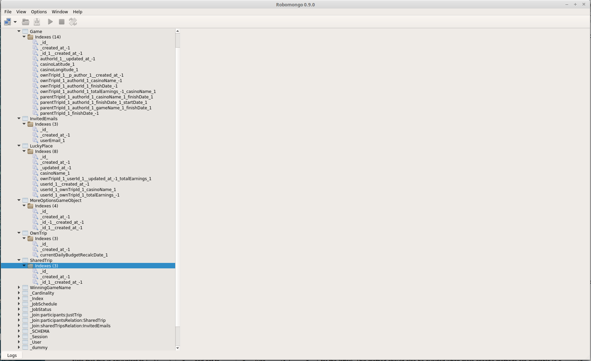
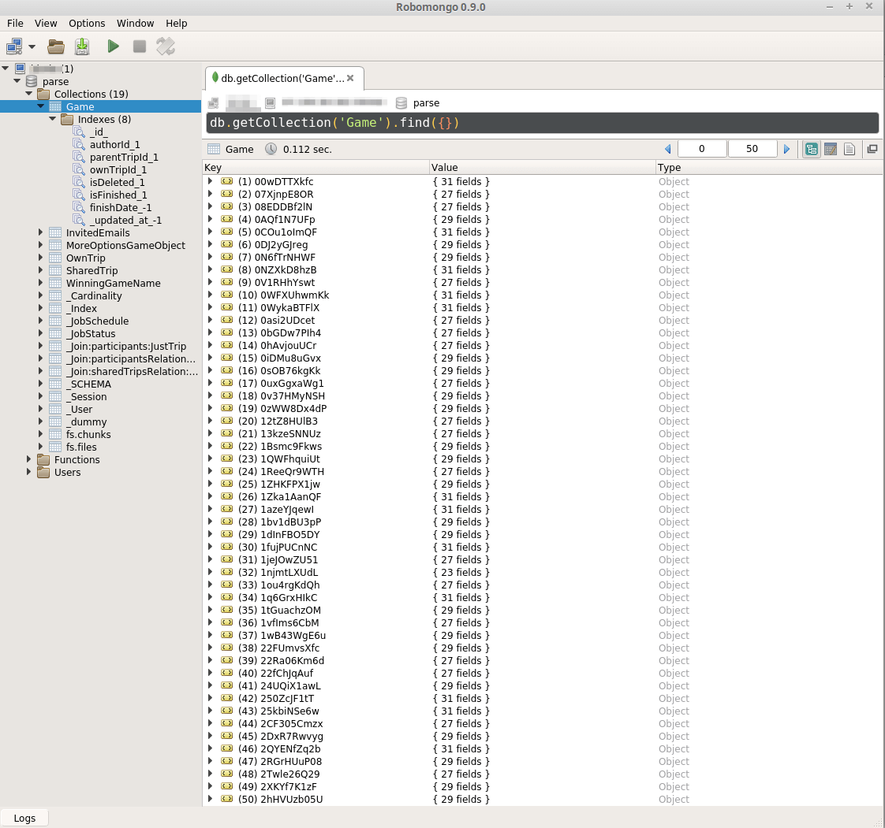
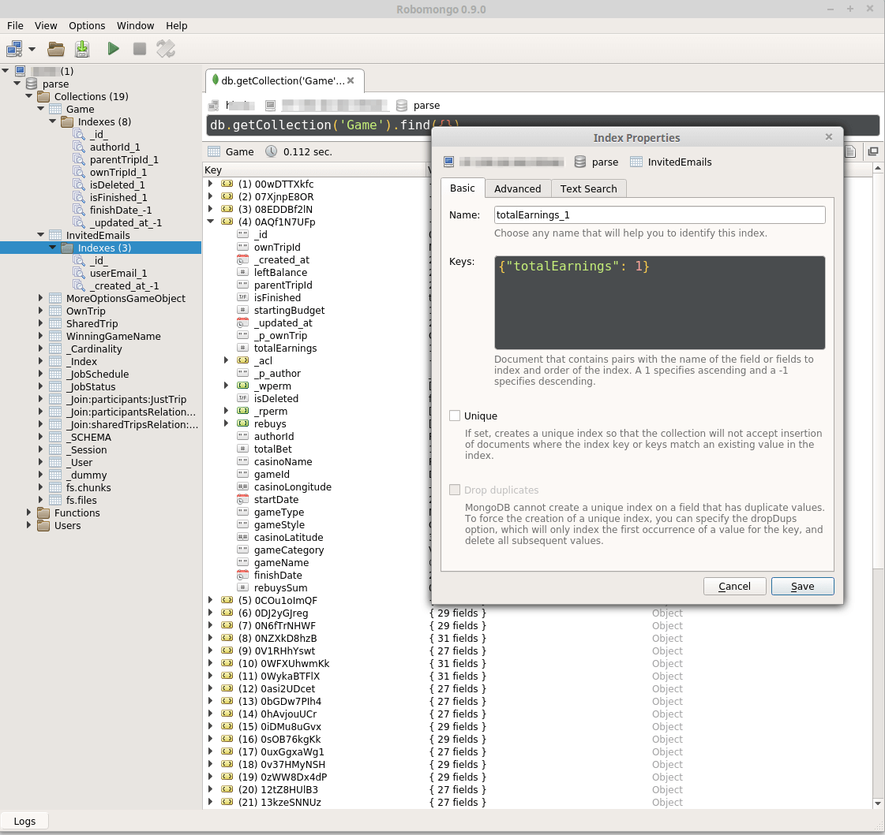

# How and why should you create indexes?

When you query any object or objects from a collection, database should find them in the collection. 
If database does not have indexes, or indexes are on the wrong fields - database will do a 
fullscan of the collection from which you request them. In this case, the bigger collection is - 
the longer to wait for results. Or worst - wrong indexes will dramatically downgrade database response time.

*Hint: migration operation automatically copies indexes from parse.com
database. This indexes are unsuitable for local parse server.  

Old indexes:


## What fields should be indexed

First of all, indexes should be created on fields, that are usually queried by your requests. 
Then, you can add indexes on fields your query is sorting by.  
For instance:
```javascript
const historyTakingPromise = new Parse.Query(TakingHistory)
        .equalTo('userId', heroUser.id)
        .greaterThanOrEqualTo('timeStart', endMoment.toDate())
        .descending('timeStart')
        .find();
```
Indexes here: 
```yml
 - { 'collection_name':'TakingHistory',
      'indexes': [
                   { 'field': 'userId', 'order': 1 },
                   { 'field': 'timeStart', 'order': 1 }
                 ]
    }
```
Notice, that we are quering user by `userId` and `timeStart`, and also sorting items by `timeStart` - so in this case we are creating indexes on these two fields.

But you should remember: a lot of indexes will slow write|update operations.
  
It's also preferable to use a combination of *single-field* indexes instead of *muliti-field*.

## Field names

In Parse API and database you have different names of collections and fields.

First of all:
- collection "_User" in database in Parse has name "User" for objects
- field objectId in parse API: in database named _id
- also fields "_created_at" and "_updated_at" in database in parse code look like 
"createdAt" and "updatedAt"

Also you should remember that in mongodb index on field "_id" is system index 
and it can't be deleted. (in case of default collection creation)

New indexes:


Another point - Parse creates a lot of different service collections.

## Order

In your ansible script you can create indexes in 2 orders:
- ascending: 1
- descending: -1

*Ascending* - means that values are ordered from **lowest to highest** (1,2,3,4 or a,b,c,d).  
*Descending* - means that values are ordered from **highest to lowest** (4,3,2,1 or d,c,b,a).  
Descending indexes should be used in date fields, when in your queries you 
requesting data from newest records.

# Ansible script

## Config example

Add `mongo_indexes` key to your `<environment>.yml` file. Describe collection name and indexes array. See example below:

```
mongo_indexes:
  - { 'collection_name':'DailyTips',
      'indexes': [
                   { 'field': '_created_at', 'order': -1 },
                   { 'field': '_updated_at', 'order': -1 }
                 ]
    }
  - { 'collection_name':'GuardianInvite',
      'indexes': [
                   { 'field': 'heroId', 'order': 1 },
                   { 'field': 'code', 'order': 1 },
                   { 'field': 'email', 'order': 1 },
                   { 'field': '_created_at', 'order': -1 }
                 ]
    }
```

## Command
Use commands to create indexes. See [Mongo(https://dev.stanfy.com/gitlab/stanfy-internals/parse-server-ansible/blob/master/docs/Mongo.md#how-work-with-index) documentation file.


# Manual creation

Right click on index folder in collection -> Add index:


