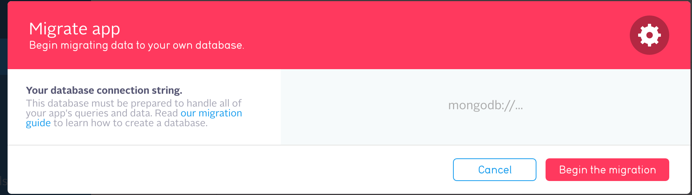

# Table of Contents
* [Mongo db migration from Parse](#mongo-db-migration-from-parse)
* [Mongo db backup](#mongo-db-backup)
* [Mongo db copy from remote server](#mongo-db-copy-from-remote-server)
* [Mongo db upload archive to server](*mongo-db-upload-archive-to-server)
* [Mongo db restore from backup archive](#mongo-db-restore-from-backup-archive)
* [Mongo db drop](#mongo-db-drop)
* [Mongo db prepare s3 configs](#mongo-db-prepare-s3-configs)
* [Mongo db run s3 backup immediately](#mongo-db-run-s3-backup-immediately)
* [Mongo db restore from s3 backup](#mongo-db-restore-from-s3-backup)
* [Access with Robomong](./Robomongo_and_access.md)

Mongo db migration from Parse
=============================

### Clean up database

Before migration it's important to clean up current database. Run [cleanup comand](#mongo-db-drop) from your project `deploy/scripts` folder.

### Generate MongoDB public URL

The public URL looks like this.

`mongodb://parse:<mongo_parse_password>@<parse_server_dns>:<mongo_port>/parse?ssl=true`

You can generate this string with next command:

```bash
#for staging
ansible-playbook -i inventories/staging mongo.yml -t get_mongo_string --ask-vault-pass

#for production
ansible-playbook -i inventories/production mongo.yml -t get_mongo_string --ask-vault-pass
```

### Start migration

Open parse.com --> your project --> Settings --> Migrate.

Enter MongoDB URL there. Confirm using MongoDB version 3.2.6 and start Migration.



#### Troubleshooting

If migration fails because of "Database is not empty" error, please, [clean up database](#mongo-db-drop) and try again.


Mongo db backup
======

### Run backup
tag:
- `backup_mongo`

env:
- `db_backup=true`

```bash
#for staging
ansible-playbook -i inventories/staging main.yml -t backup_mongo -e 'db_backup=true' --ask-vault-pass

#for production
ansible-playbook -i inventories/production main.yml -t backup_mongo -e 'db_backup=true' --ask-vault-pass
```


### Run backup with custom backupName
tag:
- `backup_mongo`

env:
- `db_backup=true`
- `db_backup_file=customName.gz`

```bash
#for staging
ansible-playbook -i inventories/staging main.yml -t backup_mongo -e 'db_backup=true db_backup_file=customName.gz' --ask-vault-pass

#for production
ansible-playbook -i inventories/production main.yml -t backup_mongo -e 'db_backup=true db_backup_file=customName.gz' --ask-vault-pass
```


### Run backup and fetch result locally
tag:
- `backup_mongo`

env:
- `db_backup=true`
- `db_backup_local_path=~/`

env optional:
- `db_backup_file=customName.gz`

```bash
#for staging
ansible-playbook -i inventories/staging main.yml -t backup_mongo -e 'db_backup=true db_backup_local_path=~/' --ask-vault-pass

#for production
ansible-playbook -i inventories/production main.yml -t backup_mongo -e 'db_backup=true db_backup_local_path=~/' --ask-vault-pass
```


Mongo db copy from remote server
======

### Run migration from remote server
tag:
- `migrate_mongo`

env:
- `db_migration_host=remote.server.com`
- `db_migration_port=47744`

```bash
#for staging
ansible-playbook -i inventories/staging main.yml -t migrate_mongo -e "db_migration_host=remote.server.com db_migration_port=47744" --ask-vault-pass

#for production
ansible-playbook -i inventories/production main.yml -t migrate_mongo -e "db_migration_host=remote.server.com db_migration_port=47744" --ask-vault-pass
```


Mongo db upload archive to server
======

### Upload backup archive from local path to server folder
tag:
- `upload_backup_mongo`

env:
- `upload_backup_path=~/backup/parse.gz`

env optional:
- `db_backup_file=customName.gz`

```bash
#for staging
ansible-playbook -i inventories/staging main.yml -t upload_backup_mongo -e 'upload_backup_path=~/backup/parse.gz' --ask-vault-pass

#for production
ansible-playbook -i inventories/production main.yml -t upload_backup_mongo -e 'upload_backup_path=~/backup/parse.gz' --ask-vault-pass
```


Mongo db restore from backup archive
======

### Restore from backup archive on remote server
tag:
- `restore_mongo`

env:
- `db_restore=true`
- `init_setup=true`

env optional:
- `db_backup_file=customName.gz`

additional:

you can combine this tags `restore_mongo` and `upload_backup_mongo` with appropriate env

```bash
#for staging
ansible-playbook -i inventories/staging main.yml -t restore_mongo -e 'db_restore=true init_setup=true' --ask-vault-pass

#for production
ansible-playbook -i inventories/production main.yml -t restore_mongo -e 'db_restore=true init_setup=true' --ask-vault-pass
```


Mongo db drop
======

Useful action before migration from Parse.com


### Caution: drop parse db
tag:
- `drop_db_mongo`

env:
- `drop_database=true`
- `init_clean=true`


```bash
#for staging
ansible-playbook -i inventories/staging mongo.yml -t drop_db_mongo -e 'drop_database=true init_clean=true' --ask-vault-pass

#for production
ansible-playbook -i inventories/production mongo.yml -t drop_db_mongo -e 'drop_database=true init_clean=true' --ask-vault-pass
```


Change MongoDB to RocksDB on working server
==========================================

Imagine that you have server, running on MongoDB and want to switch to RocksDB. You need:


* 1. Add 2 GB swap on server. What is better: add more RAM to your server :)

```
ansible-playbook -i inventories/staging init.yml -t prep_swap --ask-vault-pass
```

* 2. Switch to correct branches (rockdb) for parse-server-ansible repo.
* 3. Dump current Mongo DB

```
ansible-playbook -i inventories/staging main.yml -t backup_mongo -e 'db_backup=true db_backup_file=rock.gz' --ask-vault-pass
```

* 4. Update your server's config:

```
# mongo
mongo_version: 3.2.7
mongo_container_name: parse_rockdb
mongo_port: 47744
mongo_volume: /var/lib/parse_db_rockdb
mongo_logger_name: mongo
```

##### Please note the port number! it's 47744 (not the same as current mongo port)

* 5. Create new RockDB container on your server:

```
ansible-playbook -i inventories/staging mongo.yml --ask-vault-pass
```

* 6. Prepare backup: copy backup to new folder under root:

```
cp /var/lib/parse_db/backup/last.gz /var/lib/parse_db_rockdb/backup/
```

* 7. Restore from backup:

```
ansible-playbook -i inventories/staging mongo.yml -t restore_mongo -e 'db_restore=true init_setup=true db_backup_file=last.gz' --ask-vault-pass
```


##### On the current moment you have 2 dbs on server: MongoDB and RocksDB. Both have same data. Now we will switch from MongoDB to RockDB.


* 8. Change port to correct one:

```
mongo_port: 47744
```

* 9. Remove old Mongo container

```
docker rm -vf parse_db
```

* 10. Restart RocksDB

```
ansible-playbook -i inventories/staging mongo.yml -t restart_mongo --ask-vault-pass
```

* 11. Restart Parse server

```
ansible-playbook -i inventories/staging main.yml -t restart_parse --ask-vault-pass
```

* 12. 🙏


##### Expected result: server is running RocksDB now.


How work with index
======
### Rebuild all index

```bash
ansible-playbook -i inventories/staging mongo.yml -t rebuild_indexes -e 'rebuild_indexes=true' --ask-vault-pass
```

### Rebuilt all index in selected collection (in example "_User")
```bash
ansible-playbook -i inventories/staging mongo.yml -t rebuild_indexes_for_collection -e 'collection_to_rebuild_indexes=_User rebuild_indexes=true' --ask-vault-pass
```

### Drop all index in selected collection (in example "_User")
```bash
ansible-playbook -i inventories/staging mongo.yml -t clear_indexes_for_collection -e 'collection_to_clear_indexes=_User rebuild_indexes=true' --ask-vault-pass
```
