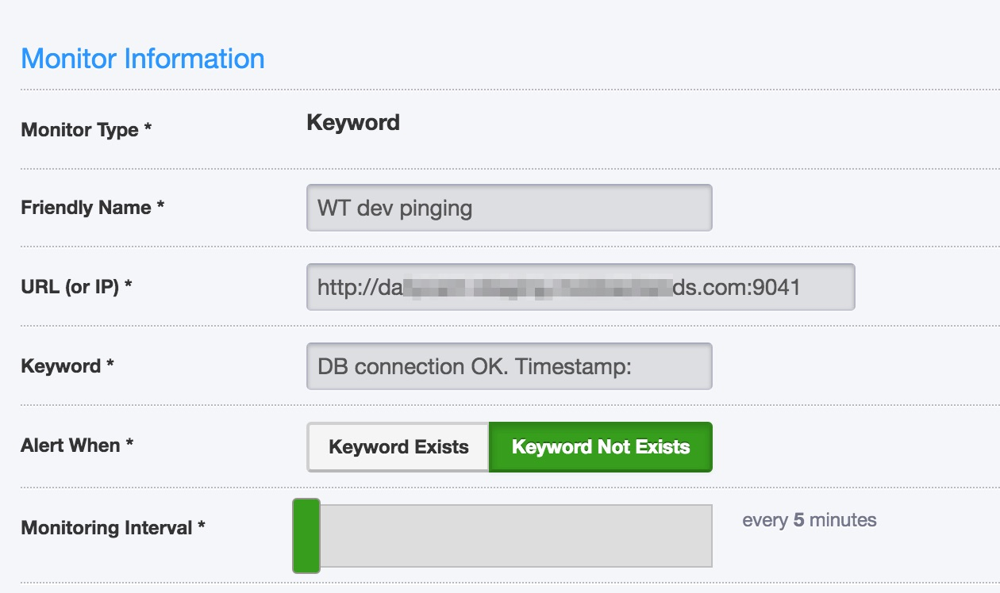
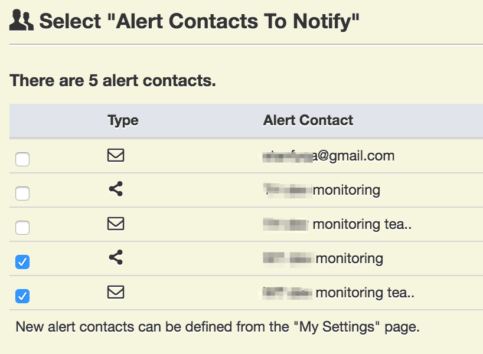

Setup monitoring for your server. We suggest to use 3 types of monitoring

- new relic web response (how long it takes for your server to respond)
- new relic server state (cpu, memory, storage amounts)
- complicated ping monitoring (monitor web page, that execute's cloud function that triggers database!)

Please, see setup instructions below.


## New Relic

You can use stanfyqa account to add your backend to server monitoring by NewRelic. 

### Override monitoring properties

You need to override license key in files `staging.yml` and `prod.yml` separately for prod and staging. It's not recommended to put license key to `all.yml` because both prod and staging will be under same NewRelic user account.

```
newrelic_license_key: 'long_license_string'
```

### Fill in newrelic.js file

Please add `newrelic.js` file to your project root folder (at the same level as `cloud/` folder). Make sure that you're using correct license key and server name.

```
'use strict'

exports.config = {
    app_name: ['My awesome server'],
    license_key: 'long_license_string',
    logging: {
        level: 'info'
    }
}
```
(proposed content of `newrelic.js` file)


### Setup Alert contacts and adjust policies

Please, setup separate application and server alert policies for your servers. Add your emails and slack web hooks. You may refer to already created alert policies.


## Ping monitoring

It's super useful to have ping monitoring. We've create template function that you may use to monitor your server's state.

### Create slap.js

Create `slap.js` file inside your `cloud` folder. It contains Cloud function that opens db and searches for first user there.

```
Parse.Cloud.define("slap", function(request, response) {
    return new Parse.Query("User")
        .limit(1)
        .find()
        .then(function(user) {
            var responseString = "DB connection OK. Timestamp: " + Date.now();
            response.success(responseString);
        }, function(error) {
            response.error(error);
        });
});
```

### Link slap.js inside main.js

Don't forget to add `slap.js` into your `main.js` file.

```
<all your imports here>

require('./slap.js');
```

### Override .yml files

You need to override `staging.yml` and `prod.yml` files to change `monitoring_url`:


```
monitoring_url: "https://{{ parse_server_dns }}/parse/functions/slap"
```

Just copy-paste this line to your files.

### User 3rd party server to ping your URL

We suggest you using [uptimerobot.com](uptimerobot.com) as ping monitoring server. You can use stanfyqa@gmail.com as login there (password is inside confluence wiki).

Add new monitoring, select `Keyword` type.

It's okay that monitoring URL looks like this:

```
http://<your server dns name>:9041
```

Please use http and 9041 port.




Do not forget to add new alert contacts! My Settings -> Add Alert Contact. You may set up email and Slack notifications.

