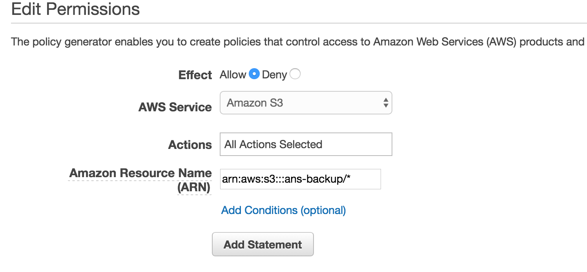
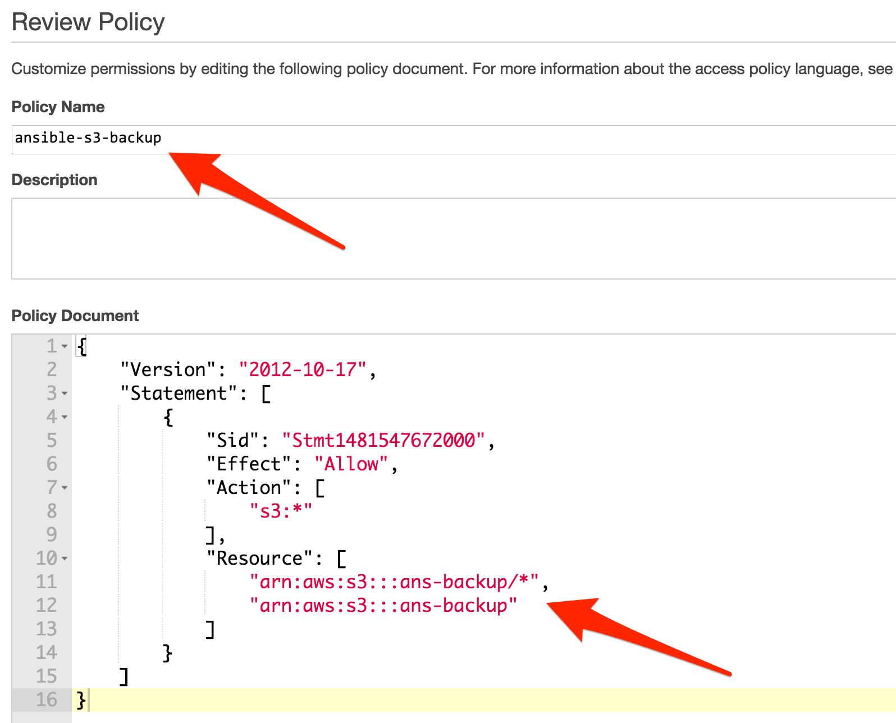

# Table of Contents
* [Mongo db prepare s3 configs](#mongo-db-prepare-s3-configs)
* [Mongo db run s3 backup immediately](#mongo-db-run-s3-backup-immediately)
* [Mongo db restore from s3 backup](#mongo-db-restore-from-s3-backup)


Mongo db prepare s3 configs
======
### Create AWS S3 bucket for backup
* Open AWS S3 https://console.aws.amazon.com/s3/home
* Create a new S3 bucket for backup
```
Example name:  ans-backup
```

### Create IAM policy
* Open AWS IAM policies https://console.aws.amazon.com/iam/home#/policies
* Create a new IAM policy for backup bucket
* Select `Policy Generator`
```
Effect: Allow
AWS Service: Amazon S3
Actions: All Actions (*)
ARN: arn:aws:s3:::ans-backup/*  (use bucket name from previous step)
```

* Press `Add Statement`
* Press `Next Step`
* Change `Policy Name`
* Change resource like below
```
"Resource": [
                "arn:aws:s3:::ans-backup/*",
                "arn:aws:s3:::ans-backup"
            ]
```

* Press `Create Policy`


### Create AWS user for backups
* Open AWS IAM https://console.aws.amazon.com/iam/home#/users
* Create new user
* Save new credentials
* Attach above policy to the user


### Edit staging.yml/production.yml config

```
# for example:
s3_backup_bucket: ans-backup
s3_backup_aws_access_key_id: YOURID
s3_backup_aws_secret_access_key: YOURKEY
s3_backup_region: us-west-1
s3_backup_script: /root/s3-db-backup.sh
s3_backup_cron_minutes: "15"
s3_backup_cron_hours: "6,18"
```

### Edit all.yml config

add 'awscli' to 'setup_common_required_packages'
```
setup_common_required_packages:
  - awscli
```

### Prepare aws client for s3 backup
tag:
- `update_packages`

```bash
#for staging
ansible-playbook -i inventories/staging init.yml -t update_packages  --ask-vault-pass

#for production
ansible-playbook -i inventories/production init.yml -t update_packages  --ask-vault-pass
```

### Prepare s3 configs and cron job on the server
tag:
- `prep_s3_backup`

env:
- `db_backup=true`


```bash
#for staging
ansible-playbook -i inventories/staging backup.yml -t prep_s3_backup -e 'db_backup=true' --ask-vault-pass

#for production
ansible-playbook -i inventories/production backup.yml -t prep_s3_backup -e 'db_backup=true' --ask-vault-pass
```


Mongo db run s3 backup immediately
======

### Run s3 buckup immediately
tag:
- `run_s3_backup`

env:
- `db_restore=true`


```bash
#for staging
ansible-playbook -i inventories/staging backup.yml -t run_s3_backup -e 'db_backup=true' --ask-vault-pass

#for production
ansible-playbook -i inventories/production backup.yml -t run_s3_backup -e 'db_backup=true' --ask-vault-pass
```


Mongo db restore from s3 backup
======
### Download archive from s3 bucket
* open https://console.aws.amazon.com/s3/home
* select your backup bucket
* download archive locally

### Upload archive to server and restore from it
tag:
- `upload_backup_mongo`
- `restore_mongo`

env:
- `db_restore=true`
- `init_setup=true`
- `upload_backup_path=~/Downloads/ps.gz` (set your path to archive from previous step)

```bash
#for staging
ansible-playbook -i inventories/staging main.yml -t upload_backup_mongo,restore_mongo -e 'db_restore=true init_setup=true upload_backup_path=~/Downloads/ps.gz' --ask-vault-pass

#for production
ansible-playbook -i inventories/production main.yml -t upload_backup_mongo,restore_mongo -e 'db_restore=true init_setup=true upload_backup_path=~/Downloads/ps.gz' --ask-vault-pass
```
